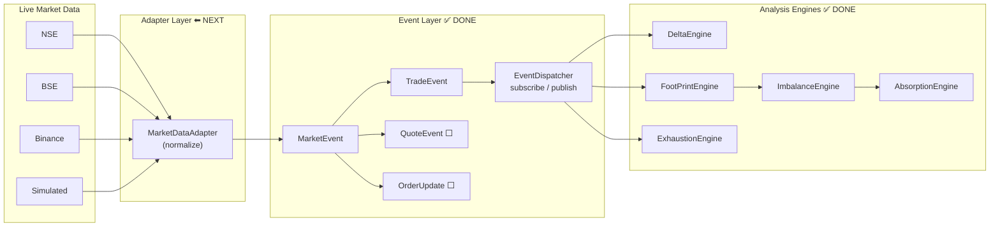
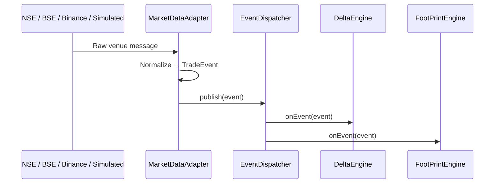

# ATHENA — AI Market Intelligence Platform

> **Last updated:** 2026-08-04  
> **Status:** Binance WebSocket streaming + FootPrint wiring ✅  
> **How we work:** Step-by-step, with conversation + market concepts + commented code

This is the **living project document**. Update the date and changelog whenever significant work lands.

---

## Changelog

| Date | Change |
|------|--------|
| 2026-08-04 | **Binance WebSocket v1** — live `@trade` stream via PowerShell bridge; DeltaEngine + FootPrintEngine both subscribe. Tests 25/25. |
| 2026-08-04 | **BinanceAdapter v1** — JSON parse + REST live feed via curl → TradeEvent → DeltaEngine. Tests 14/14 pass. |
| 2026-08-04 | Created living project doc. Mapped whiteboard architecture to codebase. Started **Adapter layer — Step 1** (base `MarketDataAdapter` + `SimulatedAdapter`). |
| — | Event bus + `EventDispatcher` confirmed complete — no changes needed. |

---

## Learning Journey (how we build together)

Each step follows the same rhythm — **you are part of every step**, not just reading the result.

| Phase | What happens |
|-------|----------------|
| **1. Concept** | What are we building? Why does the market need it? |
| **2. Whiteboard → Code** | Map your ATHENA diagram to a specific folder/class |
| **3. You learn** | Concepts to read/practice before or after coding |
| **4. We implement** | Small, reviewable change — you can ask anything mid-way |
| **5. Code comments** | Files get comments explaining *why*, not just *what* |
| **6. Verify** | Run demo/test together; check output makes market sense |

### Journey map

| Step | Topic | Market principle | Code location | Status |
|------|-------|------------------|---------------|--------|
| — | Event bus / EventDispatcher | Observer pattern — many engines listen to one feed | `backend/common/event/` | ✅ Done (no changes) |
| **1** | **Adapter + SimulatedAdapter** | Every exchange speaks a different "language"; we normalize to one | `backend/common/adapters/` | ✅ Done |
| 2 | QuoteEvent + OrderUpdateEvent | Bid/ask updates vs trades; order book changes | `backend/common/event/` | ⬜ After live adapters |
| **3a** | **BinanceAdapter (REST)** | Real venue trade prints | `backend/common/adapters/Binance*` | ✅ Done |
| **3a+** | **Binance WebSocket + FootPrint** | Live tape → Delta + Footprint | `BinanceWebSocketClient`, stream demo | ✅ Done |
| 3b | NSE adapter | Indian equity feed | `backend/common/adapters/` | ⬜ Next |
| 3c | BSE adapter | Indian equity feed | `backend/common/adapters/` | ⬜ |
| 4 | Exchange → Events bridge | Our matching engine produces trades like a real exchange | `backend/exchange/` | ⬜ Later |
| 5 | Wire MarketContext to events | Session POC, Initial Balance from live event stream | `backend/MarketContext/` | ⬜ Later |

**Living doc rule:** When we finish a step, update the changelog + step status in this table.

---

## 1. Mission

Build an **AI-powered Market Intelligence Platform** that explains market movements using:

- Order flow (delta, footprint, imbalance, absorption, exhaustion)
- Liquidity & volume profile
- Technical signals
- (Future) News, options, AI reasoning

**Codename:** ATHENA

---

## 2. Whiteboard Architecture → Code Mapping

Your whiteboard design and how it maps to this repo today:



| Whiteboard Box | Code Location | Status |
|----------------|---------------|--------|
| Live Market Data | External feeds (NSE/BSE/Binance) | Not wired |
| **Adapter** | `backend/common/adapters/` | **Step 1 in progress** |
| MarketEvent | `backend/common/event/MarketEvent.h` | ✅ |
| TradeEvent | `backend/common/event/TradeEvent.h` | ✅ |
| QuoteEvent | — | ⬜ Not implemented |
| OrderUpdateEvent | — | ⬜ Not implemented |
| EventDispatcher | `backend/common/event/EventDispatcher.h` | ✅ Done |
| AnalysisEngine | `backend/common/engine/AnalysisEngine.h` | ✅ |
| OrderFlow engines | `backend/orderflow/` | ✅ |

---

## 3. Repository Layout

```
ai-market-intelligence/
├── backend/
│   ├── common/
│   │   ├── adapters/          ← NEW: normalize exchange data → MarketEvent
│   │   ├── event/               ← EventDispatcher, TradeEvent, MarketEvent
│   │   ├── engine/              ← AnalysisEngine interface
│   │   └── types/               ← Exchange enum (NSE, BSE, Binance, CME)
│   ├── exchange/                ← OrderBook + MatchingEngine (simulated exchange)
│   ├── orderflow/               ← Delta, Footprint, Imbalance, Absorption, Exhaustion
│   └── MarketContext/           ← Volume Profile, Initial Balance
├── docs/
│   ├── PROJECT.md               ← This file (living doc)
│   └── architecture.md          ← Original design notes (order book + analytics pipeline)
├── research/                    ← Phase 1 & 2 learning notes
└── Vision.md                    ← High-level mission statement
```

---

## 4. Module Inventory

### 4.1 Common — Event Layer ✅

**Path:** `backend/common/event/`

| File | Purpose |
|------|---------|
| `MarketEvent.h` | Abstract base: `sequence()`, `exchange()`, `eventId()`, `type()`, `timestamp()`, `symbol()` |
| `TradeEvent.h/.cpp` | Concrete trade event wrapping `Trade` |
| `EventType.h` | `Trade`, `OrderAdded`, `OrderModified`, `OrderCancelled`, `Quote`, `Candle`, `SessionStart`, `SessionEnd` |
| `EventDispatcher.h/.cpp` | Observer pattern: `subscribe(AnalysisEngine*)`, `publish(MarketEvent&)` |
| `main.cpp` | Demo: manual TradeEvents → DeltaEngine |
| `run_demo.sh` | Build & run event demo |

**Design:** Pure observer. Dispatcher holds `vector<AnalysisEngine*>`. On `publish`, every subscriber gets `onEvent()`.

**Not in scope (already done):** No changes to EventDispatcher or event bus.

---

### 4.2 Common — Engine Interface ✅

**Path:** `backend/common/engine/`

```cpp
class AnalysisEngine {
    virtual void onEvent(const MarketEvent& event) = 0;
    virtual void reset() = 0;
};
```

All order-flow engines implement this and plug into `EventDispatcher`.

---

### 4.3 Common — Types ✅

**Path:** `backend/common/types/`

```cpp
enum class Exchange { NSE, BSE, Binance, CME };
```

---

### 4.4 Exchange — Matching Engine ✅

**Path:** `backend/exchange/`

Simulates a mini exchange: orders in, trades out.

| Component | File | Role |
|-----------|------|------|
| Order | `include/models/Order.h` | id, symbol, side, type, price, qty, status |
| Trade | `include/models/Trade.h` | buyOrderId, sellOrderId, price, qty, aggressorSide |
| PriceLevel | `include/models/PriceLevel.h` | Orders at one price (FIFO via DLL) |
| OrderBook | `include/orderbook/OrderBook.h` | Buy book (max price first), sell book (min price first) |
| BookSide | `include/orderbook/BookSide.h` | One side of the book per symbol |
| MatchingEngine | `include/matching/MatchingEngine.h` | LIMIT/MARKET matching logic |

**Data structures (from `architecture.md`):**

- Sell side: min-price-first priority queue + FIFO DLL per level
- Buy side: max-price-first priority queue + FIFO DLL per level
- Cancel: `map<OrderId, ListNode*>` for O(1) removal

**Note:** Exchange is **not yet connected** to the event pipeline. Trades from MatchingEngine do not auto-flow into EventDispatcher. Future bridge task.

---

### 4.5 Order Flow — Analysis Engines ✅

**Path:** `backend/orderflow/`

All engines that implement `AnalysisEngine` subscribe to `EventDispatcher` and react to `EventType::Trade`.

#### DeltaEngine ✅

Tracks aggressive buy vs sell volume.

```
Delta = Buy Volume − Sell Volume
```

- Optional rolling window (`rollingWindowSize`, 0 = session cumulative)
- Optional symbol filter
- Exposes `DeltaSnapshot` for future signal fusion

#### FootPrintEngine ✅

Per-price-level buy/sell breakdown (footprint chart backend).

- Groups prices by `tickSize` (default 0.05)
- `getLevel()`, `getPrevLevel()`, `getNextLevel()` for adjacent levels
- Exposes `FootPrintSnapshot`

#### ExhaustionEngine ✅

Detects declining volume in one direction → possible move exhaustion.

- Rolling window (default 10)
- Consecutive % declines (default 3 declines, 1% each)

#### ImbalanceEngine ✅

Stacked imbalance detection (not wired to EventDispatcher — query-only).

```
Buy imbalance:  level.buyVolume  > ratio × nextLevel.sellVolume
Sell imbalance: level.sellVolume > ratio × prevLevel.buyVolume
```

#### AbsorptionEngine ✅

Volume absorbed without price moving (depends on FootPrint + Imbalance).

- Not an `AnalysisEngine` — reads footprint state on demand

**Tests:** `backend/orderflow/tests/` — full suite including EventDispatcher integration tests.

---

### 4.6 Market Context ✅ (standalone)

**Path:** `backend/MarketContext/`

| Engine | Purpose | Wired to EventDispatcher? |
|--------|---------|---------------------------|
| VolumeProfileEngine | POC, Value Area (70%), HVN/LVN | ❌ No — `processTrade()` only |
| InitialBalanceEngine | Session opening range high/low | ❌ No — `processTrade()` only |

Future: subscribe these as `AnalysisEngine` implementations.

---

### 4.7 Research Notes

**Path:** `research/`

- **Phase 1:** Stock market basics, IPO, order types
- **Phase 2:** Order flow, footprint, POC, value area, acceptance/rejection

Read these before diving into analytics code.

---

## 5. End-to-End Flow (Target State)



**Today:** Tests and demos create `TradeEvent` manually and call `dispatcher.publish()`.  
**Next:** Adapter creates those events from raw/simulated feed data.

---

## 6. Adapter Layer — Step-by-Step Plan

The adapter sits **between live market data and EventDispatcher**. It does **not** replace the event bus.

### Step 1 — Base adapter + SimulatedAdapter ✅ (this session)

- [x] `MarketDataAdapter` abstract base class
- [x] `emit()` → `EventDispatcher::publish()`
- [x] `SimulatedAdapter` — replays synthetic ticks as `TradeEvent`
- [x] Stub placeholders: `NseAdapter`, `BseAdapter`, `BinanceAdapter`
- [x] Demo: `SimulatedAdapter → EventDispatcher → DeltaEngine`
- [x] Test: adapter publishes correct delta

### Step 2 — QuoteEvent + OrderUpdate events ⬜

- [ ] `QuoteEvent`, `OrderUpdateEvent` classes
- [ ] Adapter methods to emit non-trade events
- [ ] Engines ignore unknown types (already do)

### Step 3 — Live exchange adapters ⬜

- [ ] NSE feed parsing
- [ ] BSE feed parsing
- [ ] Binance WebSocket parsing

### Step 4 — Exchange bridge ⬜

- [ ] MatchingEngine emits TradeEvents into EventDispatcher when orders match

### Step 5 — Wire MarketContext ⬜

- [ ] VolumeProfileEngine + InitialBalanceEngine as AnalysisEngine subscribers

---

## 7. Build & Run

### Order flow tests (includes EventDispatcher tests)

```bash
cd backend/orderflow
./run_tests.sh
```

### Event dispatcher demo (manual TradeEvents)

```bash
cd backend/common/event
./run_demo.sh
```

### Adapter demo (Step 1)

```bash
cd backend/common/adapters
./run_demo.sh
```

### CMake (orderflow module)

```bash
cd backend/orderflow
mkdir -p build && cd build
cmake .. && cmake --build .
ctest
```

---

## 8. Key Types Quick Reference

| Type | Header | Notes |
|------|--------|-------|
| `MarketEvent` | `common/event/MarketEvent.h` | Abstract event |
| `TradeEvent` | `common/event/TradeEvent.h` | Wraps `Trade` |
| `EventDispatcher` | `common/event/EventDispatcher.h` | Observer bus |
| `AnalysisEngine` | `common/engine/AnalysisEngine.h` | Subscriber interface |
| `Exchange` | `common/types/Exchange.h` | NSE, BSE, Binance, CME |
| `Trade` | `exchange/include/models/Trade.h` | Core trade model |
| `Side` | `exchange/include/enums/Side.h` | BUY / SELL |
| `MarketDataAdapter` | `common/adapters/MarketDataAdapter.h` | Adapter base |

---

## 9. Analytics Pipeline (Planned Full Chain)

From `architecture.md`:

```
Trade → Delta → Footprint → Imbalance → Absorption → Exhaustion
  → Liquidity → Volume Profile → Signal Fusion → AI Reasoning
```

| Stage | Status |
|-------|--------|
| Trade (via TradeEvent) | ✅ |
| Delta | ✅ |
| Footprint | ✅ |
| Imbalance | ✅ (query-only) |
| Absorption | ✅ (query-only) |
| Exhaustion | ✅ |
| Liquidity | ⬜ |
| Volume Profile | ✅ (not event-wired) |
| Signal Fusion | ⬜ |
| AI Reasoning | ⬜ |

---

## 10. What NOT to Change

Per current plan, these are **complete** — do not refactor unless a bug is found:

- `EventDispatcher` (subscribe / publish)
- `MarketEvent` / `TradeEvent` contracts
- Existing orderflow engine logic
- Existing test suite behavior

All new work goes into **`backend/common/adapters/`** and future event types.

---

*Maintainers: update **Last updated** and **Changelog** at the top whenever you merge meaningful changes.*
